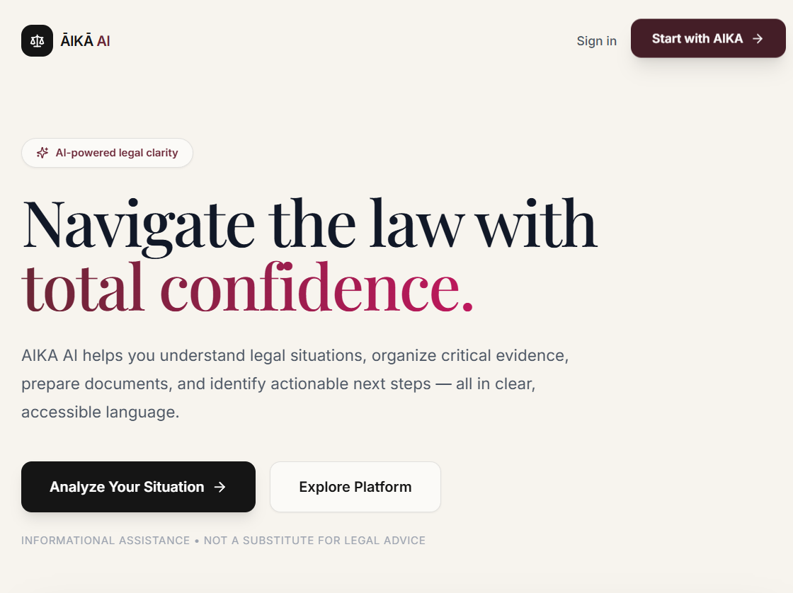

# ĀIKĀ AI

### Quietly intelligent legal clarity for everyday legal questions.

> **Understand the law. Know your options. Take the next step.**

ĀIKĀ AI is a full-stack **MERN application** designed to help users understand and organize everyday legal situations in simple language.

The platform allows users to describe a legal situation, identify key issues and possible risks, organize supporting evidence, prepare questions for a qualified professional, simplify legal text, and generate editable document drafts.

**ĀIKĀ AI provides general legal information and organizational assistance. It is not a substitute for advice from a qualified legal professional.**

---

## ✨ Features

### 🔐 Authentication & Security

* User registration and login
* Email format validation
* Secure password hashing using **bcrypt**
* JWT-based authentication
* Protected routes
* Session persistence
* Duplicate email prevention
* Login brute-force protection
* User-specific data ownership
* Centralized error handling
* Helmet security headers
* CORS protection

### 📁 Case Management

Users can create and manage legal cases with:

* Case title
* Situation description
* Jurisdiction
* Category
* Case status
* AI-generated analysis

Supported case statuses:

* `Active`
* `Pending`
* `Closed`

Cases can also be searched and filtered by title, status, and category.

### 📎 Evidence Management

Users can organize evidence associated with their cases.

Supported evidence types include:

* Rental Agreement
* Payment Receipt
* Email Conversation
* Legal Notice
* Photograph
* Other

Evidence status can be:

* `Collected`
* `Pending`
* `Missing`

### 🤖 AI Legal Assistance

ĀIKĀ AI provides several built-in assistance tools:

#### AI Analyzer

Converts a plain-language legal situation into:

* Summary
* Key Issues
* Possible Risks
* ActionPath
* Questions for a Professional
* Missing Information
* Legal category
* Jurisdiction

#### Legal Simplifier

Converts complicated legal clauses, notices, or contract sections into easier-to-understand language.

#### Draft Studio

Generates editable document drafts based on a case and user instructions.

Supported draft types:

* Complaint Draft
* Request Letter
* Response Letter
* Evidence Checklist
* Professional Consultation Summary

#### AI History

Previous AI interactions are stored and can be reviewed by the user.

---

## 🧠 Built-in AI Engine

ĀIKĀ AI currently uses an **inbuilt deterministic rule-based engine** located at:

```text
backend/src/services/aikaEngine.js
```

There is **no Gemini API, OpenAI API, or external AI provider** required.

The engine classifies situations using keyword-based themes:

* Housing
* Employment
* Family
* Consumer
* Civil
* General

The selected category is then used to generate structured legal-information templates containing issues, risks, action steps, professional questions, and missing information.

### AI Processing Flow

```text
User Situation
      │
      ▼
React Frontend
      │
      ▼
Express REST API
      │
      ▼
ĀIKĀ AI Engine
      │
      ├── Classification
      ├── Risk Identification
      ├── ActionPath Generation
      ├── Professional Questions
      └── Missing Information
      │
      ▼
Structured JSON Response
      │
      ├── Case Analysis
      ├── AI History
      └── Consultation Questions
      │
      ▼
React UI
```

The engine produces structured output rather than unrestricted free-form responses and is designed not to fabricate statutes, cases, or legal citations.

---

# 🛠️ Technology Stack

| Layer             | Technology                     |
| ----------------- | ------------------------------ |
| Frontend          | React 18.3                     |
| Build Tool        | Vite 6                         |
| Styling           | Tailwind CSS 3.4               |
| Animations        | Framer Motion 11               |
| Icons             | Lucide React                   |
| Routing           | React Router 7                 |
| HTTP Client       | Axios                          |
| Backend           | Node.js 24                     |
| API Framework     | Express.js 4.21                |
| ODM               | Mongoose 8.6                   |
| Database          | MongoDB                        |
| Authentication    | JWT                            |
| Password Security | bcrypt                         |
| Security          | Helmet, CORS                   |
| Configuration     | dotenv                         |
| AI                | Inbuilt ĀIKĀ rule-based engine |

The current project uses MongoDB locally or MongoDB Atlas through the `MONGODB_URI` environment variable.

---

# 🏗️ System Architecture

```text
┌──────────────────────────────────────────────────────┐
│                    USER / BROWSER                    │
│                                                      │
│       React + Vite + Tailwind CSS + Framer Motion   │
└───────────────────────┬──────────────────────────────┘
                        │
                        │ Axios + JWT
                        ▼
┌──────────────────────────────────────────────────────┐
│                  EXPRESS REST API                    │
│                                                      │
│  Authentication │ Cases │ Evidence │ Documents      │
│  AI Operations  │ Dashboard │ Health                │
└──────────────┬───────────────────────┬───────────────┘
               │                       │
               ▼                       ▼
┌────────────────────────┐   ┌─────────────────────────┐
│       MongoDB          │   │    ĀIKĀ AI ENGINE       │
│                        │   │                         │
│ Users                  │   │ Keyword Classification │
│ Cases                  │   │ Risk Analysis          │
│ Evidence               │   │ ActionPath             │
│ Documents              │   │ Legal Simplification   │
│ Consultations          │   │ Document Generation    │
│ AI Interactions        │   │                         │
└────────────────────────┘   └─────────────────────────┘
```

### Request Lifecycle

```text
React
  ↓
Axios
  ↓
Express Route
  ↓
JWT Authentication
  ↓
Controller
  ↓
Mongoose / MongoDB
  ↓
ĀIKĀ AI Engine (AI routes)
  ↓
Structured Response
  ↓
React UI
```

---

# 📂 Project Structure

```text
aika-ai/
│
├── frontend/
│   ├── public/
│   ├── src/
│   │   ├── components/
│   │   │   ├── Logo.jsx
│   │   │   ├── StatCard.jsx
│   │   │   └── LoadingAI.jsx
│   │   │
│   │   ├── context/
│   │   │   └── AuthContext.jsx
│   │   │
│   │   ├── layouts/
│   │   │   └── Layout.jsx
│   │   │
│   │   ├── pages/
│   │   │   ├── Landing.jsx
│   │   │   ├── Auth.jsx
│   │   │   ├── Dashboard.jsx
│   │   │   ├── Cases.jsx
│   │   │   ├── CasePage.jsx
│   │   │   ├── AIAnalyzer.jsx
│   │   │   ├── Simplifier.jsx
│   │   │   ├── DraftStudio.jsx
│   │   │   ├── Documents.jsx
│   │   │   └── Profile.jsx
│   │   │
│   │   ├── services/
│   │   │   └── api.js
│   │   │
│   │   ├── App.jsx
│   │   ├── main.jsx
│   │   └── index.css
│   │
│   ├── index.html
│   ├── package.json
│   ├── vite.config.js
│   ├── tailwind.config.js
│   ├── postcss.config.js
│   └── .env.example
│
├── backend/
│   ├── src/
│   │   ├── config/
│   │   │   └── db.js
│   │   │
│   │   ├── controllers/
│   │   │   ├── authController.js
│   │   │   ├── caseController.js
│   │   │   ├── evidenceController.js
│   │   │   ├── documentController.js
│   │   │   └── aiController.js
│   │   │
│   │   ├── middleware/
│   │   │   ├── authMiddleware.js
│   │   │   └── errorMiddleware.js
│   │   │
│   │   ├── models/
│   │   │   ├── User.js
│   │   │   ├── Case.js
│   │   │   ├── EvidenceItem.js
│   │   │   ├── Document.js
│   │   │   ├── Consultation.js
│   │   │   └── AIInteraction.js
│   │   │
│   │   ├── routes/
│   │   │   ├── authRoutes.js
│   │   │   ├── caseRoutes.js
│   │   │   ├── evidenceRoutes.js
│   │   │   ├── documentRoutes.js
│   │   │   ├── aiRoutes.js
│   │   │   └── dashboardRoutes.js
│   │   │
│   │   ├── services/
│   │   │   ├── aikaEngine.js
│   │   │   └── documentService.js
│   │   │
│   │   └── server.js
│   │
│   ├── package.json
│   └── .env.example
│
├── docs/
│   └── screenshots/
│
├── .gitignore
├── README.md
└── document.md
```

---

# 🗄️ Database Design

Database name:

```text
aika_ai
```

The application uses six primary MongoDB collections.

### Users

Stores user account information.

```text
User
├── name
├── email
├── password
├── jurisdiction
├── createdAt
└── updatedAt
```

### Cases

Stores legal case information.

```text
Case
├── user
├── title
├── description
├── jurisdiction
├── category
├── status
├── aiAnalysis
├── risks
├── actionPath
└── questions
```

### EvidenceItems

Stores evidence related to cases.

```text
EvidenceItem
├── user
├── case
├── name
├── description
├── type
├── status
├── createdAt
└── updatedAt
```

### Documents

Stores generated and editable document drafts.

```text
Document
├── user
├── case
├── title
├── type
├── content
├── createdAt
└── updatedAt
```

### Consultations

Stores questions and notes prepared for professional consultation.

```text
Consultation
├── user
├── case
├── questions
├── notes
├── createdAt
└── updatedAt
```

### AIInteractions

Stores previous AI operations.

```text
AIInteraction
├── user
├── case
├── type
├── input
├── output
├── createdAt
└── updatedAt
```

The database design and ownership relationships are implemented through Mongoose models and indexed user references.

---

# ⚙️ Installation

## Prerequisites

Make sure the following are installed:

* Node.js
* npm
* MongoDB Community Server or MongoDB Atlas
* Git

Check your Node.js and npm versions:

```bash
node --version
npm --version
```

---

# 📥 Clone the Repository

```bash
git clone <YOUR_GITHUB_REPOSITORY_URL>
cd aika-ai
```

---

# 📦 Install Dependencies

### Backend

```bash
cd backend
npm install
```

### Frontend

```bash
cd ../frontend
npm install
```

---

# 🔑 Environment Variables

## Backend

Create:

```text
backend/.env
```

Add:

```env
PORT=5000
MONGODB_URI=mongodb://127.0.0.1:27017/aika_ai
JWT_SECRET=your_long_random_secret
CLIENT_URL=http://localhost:5173
```

For MongoDB Atlas, replace `MONGODB_URI` with your Atlas connection string.

## Frontend

Create:

```text
frontend/.env
```

Add:

```env
VITE_API_URL=http://localhost:5000/api
```

> **Important:** Never commit `.env` files or private secrets to GitHub.

The project does not require an AI API key because the AI functionality is provided by the built-in ĀIKĀ engine.

---

# ▶️ Running the Application

Open two terminals.

## Terminal 1 — Backend

```bash
cd backend
npm start
```

For development:

```bash
npm run dev
```

Backend:

```text
http://localhost:5000
```

## Terminal 2 — Frontend

```bash
cd frontend
npm run dev
```

Frontend:

```text
http://localhost:5173
```

Open the application in your browser:

```text
http://localhost:5173
```

The backend health endpoint is:

```text
http://localhost:5000/api/health
```

The application requires MongoDB to be running locally or a valid MongoDB Atlas connection.

---

# 👤 Demo Account

For development mode, a demo account is available:

```text
Email:    demo@aika.ai
Password: AikaDemo@123
```

Users can also create their own account through the registration page.

> **Security Note:** Do not use the demo credentials in a production deployment.

---

# 🧭 Application Routes

| Route         | Access    | Description              |
| ------------- | --------- | ------------------------ |
| `/`           | Public    | Landing page             |
| `/login`      | Public    | User login               |
| `/register`   | Public    | Account registration     |
| `/dashboard`  | Protected | Dashboard and statistics |
| `/cases`      | Protected | Case management          |
| `/cases/:id`  | Protected | Case details             |
| `/ai`         | Protected | AI Analyzer              |
| `/simplifier` | Protected | Legal Simplifier         |
| `/drafts`     | Protected | Draft Studio             |
| `/documents`  | Protected | Saved documents          |
| `/profile`    | Protected | User profile             |

---

# 🔌 API Reference

All API endpoints use:

```text
/api
```

Protected endpoints require:

```http
Authorization: Bearer <JWT_TOKEN>
```

## Authentication

| Method | Endpoint             | Description         |
| ------ | -------------------- | ------------------- |
| POST   | `/api/auth/register` | Register a new user |
| POST   | `/api/auth/login`    | Login               |
| GET    | `/api/auth/me`       | Get current user    |

## Cases

| Method | Endpoint         | Description      |
| ------ | ---------------- | ---------------- |
| GET    | `/api/cases`     | Get user's cases |
| POST   | `/api/cases`     | Create a case    |
| GET    | `/api/cases/:id` | Get a case       |
| PUT    | `/api/cases/:id` | Update a case    |
| DELETE | `/api/cases/:id` | Delete a case    |

## Evidence

| Method | Endpoint            | Description     |
| ------ | ------------------- | --------------- |
| GET    | `/api/evidence`     | Get evidence    |
| POST   | `/api/evidence`     | Add evidence    |
| PUT    | `/api/evidence/:id` | Update evidence |
| DELETE | `/api/evidence/:id` | Delete evidence |

## Documents

| Method | Endpoint             | Description     |
| ------ | -------------------- | --------------- |
| GET    | `/api/documents`     | Get documents   |
| POST   | `/api/documents`     | Create document |
| PUT    | `/api/documents/:id` | Update document |
| DELETE | `/api/documents/:id` | Delete document |

## AI

| Method | Endpoint                    | Description                |
| ------ | --------------------------- | -------------------------- |
| POST   | `/api/ai/analyze`           | Analyze legal situation    |
| POST   | `/api/ai/explain`           | Explain legal information  |
| POST   | `/api/ai/simplify`          | Simplify legal text        |
| POST   | `/api/ai/generate-document` | Generate a document draft  |
| GET    | `/api/ai/history`           | Get AI interaction history |

## Dashboard

| Method | Endpoint               | Description              |
| ------ | ---------------------- | ------------------------ |
| GET    | `/api/dashboard/stats` | Get dashboard statistics |

The complete API structure is implemented around authentication, cases, evidence, documents, AI operations, and dashboard statistics.

---

# 🧪 Example AI Request

Example request:

```http
POST /api/ai/analyze
```

Request body:

```json
{
  "situation": "My landlord has not returned my security deposit after I moved out.",
  "jurisdiction": "India"
}
```

The response contains structured information such as:

```json
{
  "summary": "...",
  "keyIssues": [
    "..."
  ],
  "possibleRisks": [
    "..."
  ],
  "actionPath": [
    {
      "title": "...",
      "description": "..."
    }
  ],
  "questionsForProfessional": [
    "..."
  ],
  "missingInformation": [
    "..."
  ],
  "category": "Housing",
  "jurisdiction": "India",
  "disclaimer": "AIKA AI provides general legal information and organizational assistance. It is not a substitute for advice from a qualified legal professional."
}
```

---

# 🔒 Security

ĀIKĀ AI implements several security mechanisms:

* bcrypt password hashing
* JWT authentication
* Protected API routes
* User ownership checks
* Email normalization and validation
* Duplicate email prevention
* Login brute-force protection
* Helmet security headers
* CORS allowlist
* Request body size limitation
* Environment-based secrets
* Input validation
* Centralized error handling
* Cross-user data isolation

Every private resource is scoped to the authenticated user to prevent unauthorized access.

---

# 🛡️ Responsible AI

ĀIKĀ AI is designed as an **assistive legal-information and organization tool**.

The system:

* Does not claim to be a lawyer.
* Does not guarantee legal outcomes.
* Does not intentionally fabricate laws, statutes, cases, or citations.
* Provides a disclaimer with generated legal-information responses.
* Uses a deterministic and auditable rule-based engine.
* Does not send user data to an external AI service.

Users should consult a qualified legal professional for advice regarding their specific legal circumstances.

---

# 🧪 Testing & Verification

The application has been tested across the major application workflows.

### Authentication

* Registration
* Login
* Duplicate email handling
* Invalid credentials
* Weak password validation
* JWT authentication
* Protected routes
* Login rate limiting

### Case Management

* Create case
* Read case
* Update case
* Delete case
* Search cases
* Filter cases

### AI Features

* AI analysis
* Legal explanation
* Legal simplification
* Document generation
* AI history

### Security

* Invalid token handling
* Missing token handling
* Cross-user isolation
* Ownership validation
* Invalid ObjectId handling

### Frontend

* Production build
* Protected route redirection
* Dashboard rendering
* Case management
* AI Analyzer
* Legal Simplifier
* Draft Studio
* Documents
* Profile

The documented verification covers the full API journey and frontend application flow.

---

# ⚠️ Limitations

Current limitations include:

* AI responses are generated using template-based rule logic.
* The system does not provide specific legal citations.
* Generated documents require professional review.
* PDF/DOCX document upload and parsing are not currently supported.
* Login rate-limit counters are stored in memory.
* Email addresses are validated but not email-verified.

---

# 🚀 Future Enhancements

Planned improvements include:

* PDF and DOCX document extraction
* Email verification
* Password reset
* Multi-language legal explanations
* Two-factor authentication
* Redis-based rate limiting
* Role-based access for legal-aid organizations
* Case timeline visualization
* Exportable consultation packages

---

# 📸 Screenshots

Add project screenshots inside:

```text
docs/screenshots/
```

Suggested screenshots:

```text
01-landing.png
02-login.png
03-dashboard.png
04-cases.png
05-case-detail.png
06-ai-analyzer.png
07-simplifier.png
08-draft-studio.png
09-documents.png
```

Then display them in this section:

```markdown
## 📸 Screenshots

### Landing Page


### Dashboard


### AI Analyzer


### Legal Simplifier

```

---

# 📄 Documentation

Project documentation includes:

* Project report
* System architecture
* Database design
* API documentation
* Screenshots
* Demo video
* Installation instructions

---

# ⚖️ Disclaimer

ĀIKĀ AI is intended for **general legal information, organization, and preparation purposes only**.

It does not provide legal advice, establish an attorney-client relationship, or guarantee any legal outcome.

Always consult a qualified legal professional for advice concerning your specific situation.

---

# 👩‍💻 Author

**Rethika S**

Computer Science Engineering Student
Full Stack Development | AI | Web Technologies

---

# 📜 License

This project is developed for **academic, learning, and demonstration purposes**.

If you plan to use, distribute, or deploy the project commercially, add an appropriate open-source or proprietary license.

---

## ⭐ ĀIKĀ AI

> **Understand the law. Know your options. Take the next step.**
